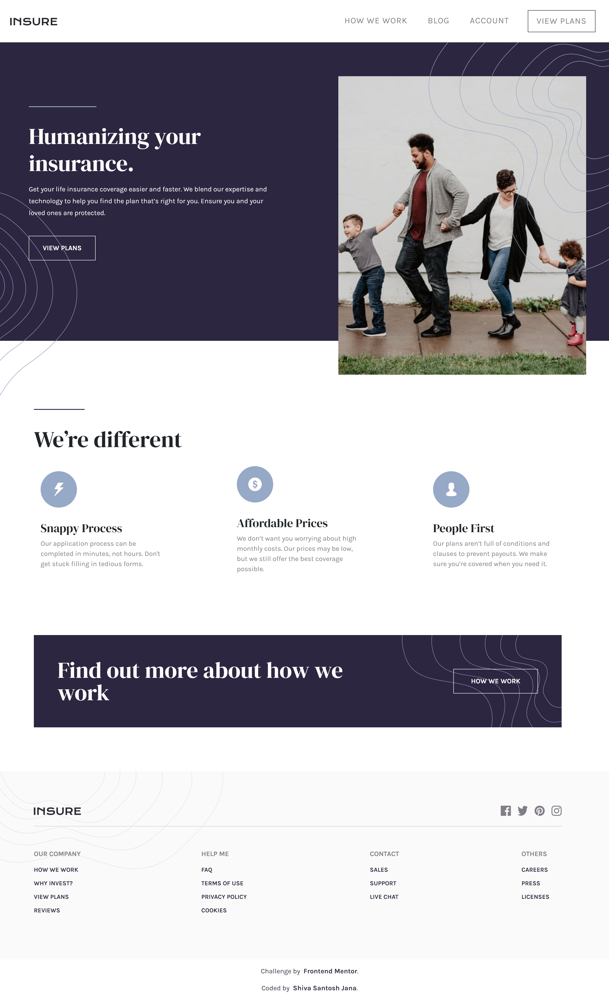
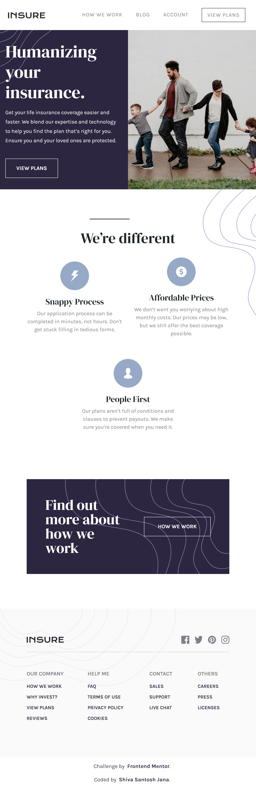
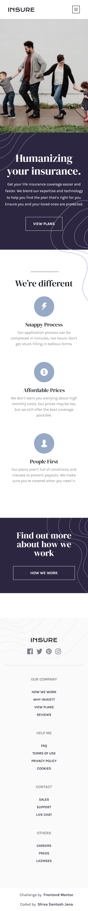

# Frontend Mentor - Insure landing page solution

This is a solution to the [Insure landing page challenge on Frontend Mentor](https://www.frontendmentor.io/challenges/insure-landing-page-uTU68JV8). Frontend Mentor challenges help you improve your coding skills by building realistic projects.

## Table of contents

- [Overview](#overview)
  - [The challenge](#the-challenge)
  - [Screenshots](#screenshots)
  - [Links](#links)
- [My process](#my-process)
  - [Built with](#built-with)
  - [What I learned](#what-i-learned)
  - [Continued development](#continued-development)
  - [Useful resources](#useful-resources)
- [Author](#author)

## Overview

### The challenge

Users should be able to:

- View the optimal layout for the site depending on their device's screen size
- See hover states for all interactive elements on the page

### Screenshots

Desktop version

Tablet version

Mobile version

### Links

- Solution URL: [Code on GitHub](https://github.com/santu369/frontendmentor-insure-landing-page)
- Live Site URL: [Netlify Live URL](https://santu369-frontendmentor-insure-landing-page.netlify.app/)

## My process

Worked on Mobile first approach, then added media queries, adjusting the layout.
Used React for building the app using component based approach and Bootstrap for layout.
Split the code into as many reusable components as possible. Can be useful if we have more pages for the site.

### Built with

- Semantic HTML5 markup
- CSS custom properties
- Flexbox
- Mobile-first workflow
- BEM Methodology
- SASS
- Bootstrap
- React
- Intersection Observer
- Framer Motion

### What I learned

Improved on creating components for the webpage.
Using framer motion with intersection observer to add small animations to any react site.

### Continued development

Continue focusing more on react and more animation libraries.

### Useful resources

- [Sass](https://sass-lang.com/) - Installing and Learning Sass.
- [BEM](https://en.bem.info/methodology/quick-start/) - Quick Start with BEM.
- [W3C Markup Validation Service](https://validator.w3.org/) - Validator for checking the markup validity of Web documents in HTML, XHTML, SMIL, MathML, etc.
- [W3C CSS Validation Service](https://jigsaw.w3.org/css-validator/) - Check Cascading Style Sheets (CSS) and (X)HTML documents with style sheets.
- [Bootstrap CSS](https://getbootstrap.com/docs/5.0/getting-started/introduction/) - Getting started with Bootstrap.
- [React](https://reactjs.org/) - Javascript library for building interfaces.
- [Solve Netlify Error](https://dev.to/kapi1/solved-treating-warnings-as-errors-because-of-process-env-ci-true-bk5) - Solve **Treating warnings as errors because of process.env.CI = true** Netlify Build Error.
- [Framer Motion](https://www.npmjs.com/package/framer-motion) - Open source and production-ready motion library for React on the web.
- [React Intersection Observer](https://www.npmjs.com/package/react-intersection-observer) - React implementation of the Intersection Observer API. Monitor if a component is inside the viewport, using IntersectionObserver API.

## Author

- Website - [Shiva Santosh Jana](https://santu369.github.io/FreeCodeCamp-PersonalPortfolioWebpage)
- Frontend Mentor - [@santu369](https://www.frontendmentor.io/profile/santu369)
- Twitter - [@santu69](https://www.twitter.com/santu69)
